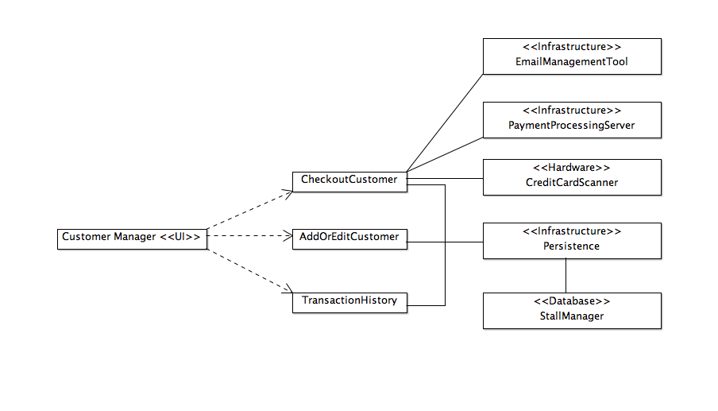
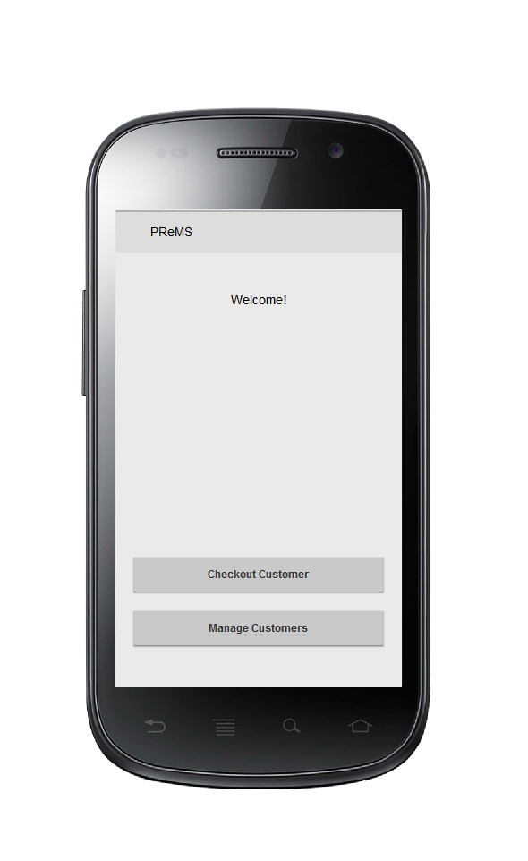
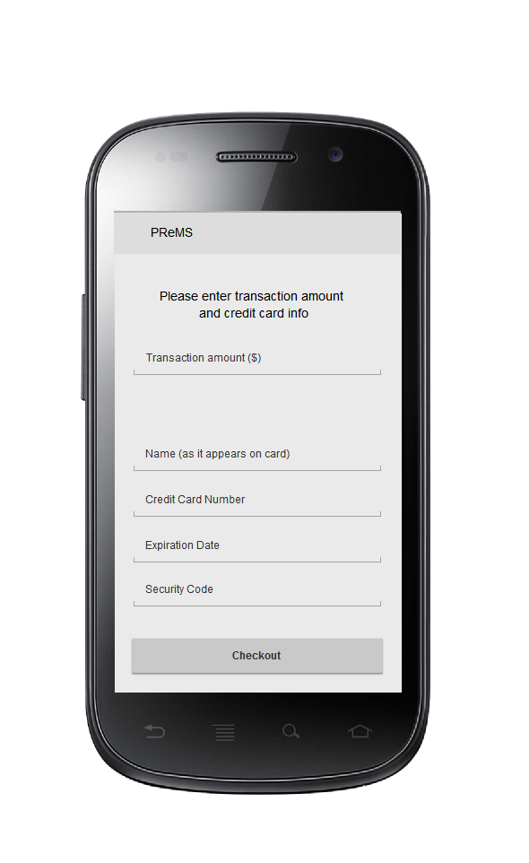
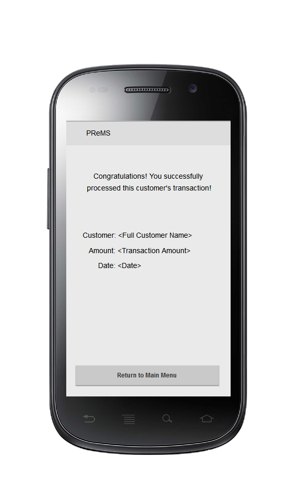
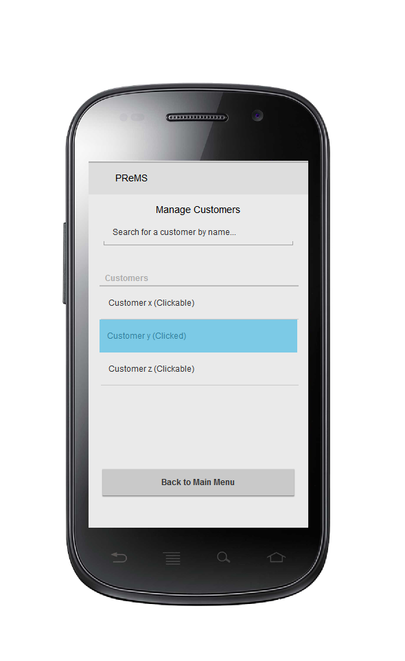
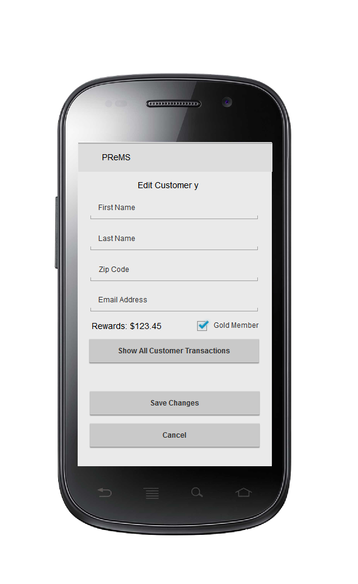

# Design Document

**Author**: Team 1

## 1 Design Considerations

### 1.1 Assumptions

* Each customer has many transactions
* The association between a customer and a transaction is through the running of a credit card
* A transaction can have multiple discounts
* There is a Reward discount and a Gold Status discount
* After a transaction is created, the customer either has or does not have a reward discount
* The customer can only purchase using a credit card - cash purchase is not allowed
* A customer and his/her credit card information is allowed to be added or edited
* A tracking system will keep track of all previous transactions - including various types of associated discounts
* The discounts have their amounts hard coded
* The customer has a boolean that shows whether or not the gold status discount should be applied to that transaction
* The customer uses their transactions to check if they're in the gold status
* The transaction sends the emails notifying rewards when either they have transaction amounts YTD totaling over $1000, changing them to gold status, or the single transaction was over $100, giving them $10 off next time
* The system's hardware is capable to connect with a payment-processing service provider that can process credit card transactions
* The user interacts with the software using an app which runs on the android operating system
* The currency for purchase is USD
* Midnight of January 1 in EST is regarded as the start of new year, at which point the reward calculation would begin
* Discounts and Gold Status attached to a customer do not expire, and persist indefinitely

### 1.2 Constraints

* This application is only available on android based operating system. The user cannot make a purchase using apple or windows etc based operating systems.
* The application relies on external vendors such as an email management tool, payment processing server and credit card scanner. Any hardware/software failure with these tools could render the application unusable
* The user is not allowed to pay using cash
* The user is not allowed to return/refund any purchased items
* The user cannot use any accumulated discounts for a cash-back. All discounts would be applied to subsequent transactions

### 1.3 System Environment

* This application will only run on android based operating systems. The hardware would include android based cellular devices, tablet devices or PCs
* The software is written in java and makes extensive use of java standard libraries. The hardware should be able to support java 1.7.
* The system interacts with external hardware such as credit card scanner and external software vendors such as payment processing server and email management application. 
* The APIs used to interact with external hardware and software should have a java interface to them
* A database may be needed to store transactional history for individual customers. We are not sure what type of database is required for this project and it may be out of scope at this point. Another technique to rectify this issue is to maintain an internal cache of all the transactions

## 2 Architectural Design

### 2.1 Component Diagram

### 2.2 Deployment Diagram

This is a simple android application and the deployment is straightforward as the application code will reside on the device once it has been coded up using an android emulator.

## 3 Low-Level Design

### 3.1 Class Diagram

## 4 User Interface Design

Mockups of several ui elements:

