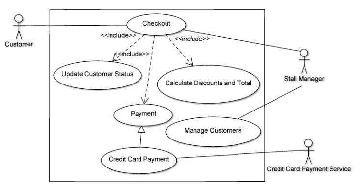

# Use Case Model

**Author**: Team 01 

## 1 Use Case Diagram

## 2 Use Case Descriptions

1. Manage a customer.
	- Requirements: The stall manager must be able to manage a customer account and view their information.
	- Pre-conditions: The customer does not exist or the customer has information that needs to be changed.
	- Post-conditions: The customer exists in the system and has correct information.
	- Scenarios:
		* The customer is a new customer.
		* The customer is an existing customer.

2. Check out a customer.
	- Requirements: The stall manager must be able to check out a customer.
	- Pre-conditions: The customer exists in the system.
	- Post-conditions: A transaction has been added to the customer's account and their rewards information is potentially updated. The customer's discounts have been applied and their total calculated. Their credit card has been charged.
	- Scenarios:
		* The customer has neither discounts added nor discounts applied.
		* The customer has their gold status upgraded.
		* The customer has a rewards discount added.
		* The customer has their gold status upgraded and a rewards discount added.
		* The customer has a gold status discount applied.
		* The customer has a rewards discount applied.
		* The customer has a gold status discount applied and a rewards discount applied.
		* The customer has their gold status upgraded and a rewards discount applied.
		* The customer has a gold status discount applied and a rewards discount added.